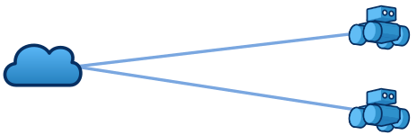
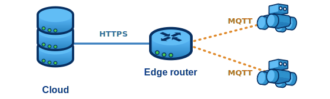
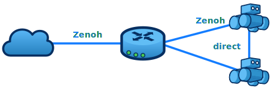
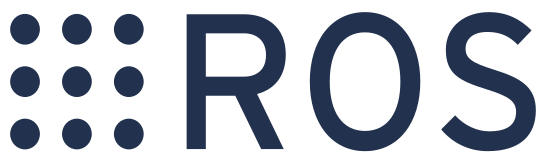
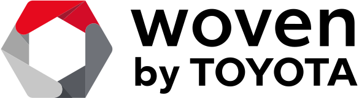
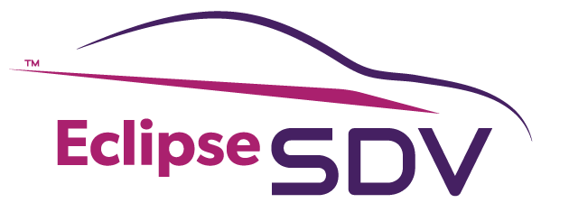
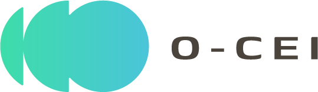

<!-- _class: prob -->

# Zenoh — the next step in cloud · edge · IoT architecture evolution

### Pure cloud

Every device talks straight to the cloud. Simple, but high latency, low bandwidth, and nothing works when the link drops.

### Edge architecture

An edge router adds fast, local processing — at the cost of complexity and a different protocol on every hop (HTTPS, MQTT…).

### Zenoh

One protocol across cloud, router and devices, with direct peer-to-peer links — transport-agnostic, any topology, minimal overhead, even *inside* a single robot.

## Zenoh adoption

ROS 2 middleware <code>rmw_zenoh</code>

Software-defined vehicles

Automotive connectivity

Automotive silicon

Open in-vehicle stack

PARTNER

Cloud·Edge·IoT continuum — Zenoh is its connectivity layer

---

<!-- _class: small -->

# The Challenge — what you'll build

Pick a language you like and build a **prototype distributed app** whose instances **discover their counterparts and connect to each other** — over the local network *and* through the cloud. The work grows in **three levels**:

- **Level 1 — Basics.** Install Zenoh; run the publish/subscribe and query/reply examples.
- **Level 2 — Local network.** Instances discover each other and interact over the LAN, **with no central server**.
- **Level 3 — Cloud.** Connect through a Zenoh node in the cloud (config + access keys provided) so peers reach each other **from anywhere** — same code, Zenoh decides where the data flows.

## Pick a scenario — or invent your own

ChatFile sharingVideo / audio streamingMultiplayer gameCollaborative whiteboardRobot / drone teleopShared clipboard

**Definition of Done** — a **GitHub repo** with the sources and clear build/run instructions; the **same app** runs peer-to-peer on the LAN (L2) and over the cloud (L3) without changing its logic.

**A good Day-2 demo** — two laptops running your app find each other on the local network with no server, then a **remote peer joins through the cloud router** and it just works.

---

<!-- _class: small -->

# Who it's for · what we provide

This track suits anyone curious about **distributed systems, networking and real-time apps** — and **no prior Zenoh experience is required**.

## Profiles that will enjoy it

- **Any language, any OS** — Rust, C, C++, Python, TypeScript, Kotlin, Java or Go, on Linux, macOS or Windows.
- From **embedded / microcontroller** hackers to **web / cloud** developers and **game · IoT · robotics** builders.
- People who like to **think out of the box** — originality is part of the score.

## What we provide

- **Repos & starting points** — the challenge guide, the `zenoh-ts` browser-chat example, the [zenoh-arena](https://github.com/milyin/zenoh-arena) game-state library, and the [zenoh-demos](https://github.com/eclipse-zenoh/zenoh-demos) gallery.
- **Docs** — the Zenoh introduction, a verified installation guide, and the self-hosted-router setup.
- **A cloud Zenoh router** with the access and **TLS keys** handed to you for Level 3.
- **On-site mentoring / office hours** from the Zenoh team, with the **evaluation criteria shared up front** so you know what *good* looks like.
