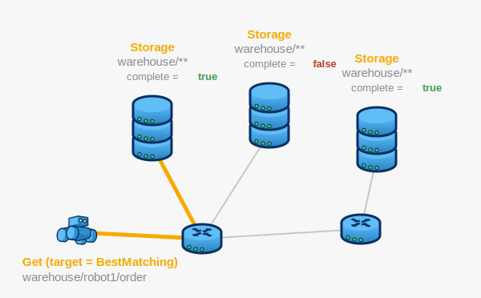
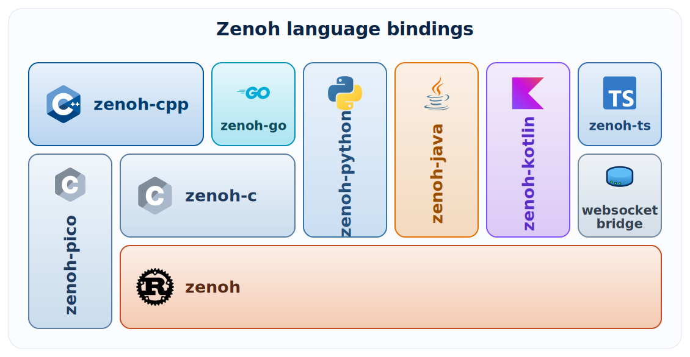

# &nbsp; Eclipse Zenoh

[Zenoh](https://zenoh.io/) is a data-oriented publish / subscribe and query / reply network protocol. Data is addressed by slash-separated keys, e.g. `room/sensor/temp`.

Zenoh was developed to provide a universal communication protocol that works at every infrastructure level, from microcontrollers to the cloud.

The best starting points to read about Zenoh are the project site [zenoh.io](https://zenoh.io/) and the [Zenoh book](https://corsaro.me/fr/zenoh/book/). The most thorough documentation of Zenoh's concepts and API is [Zenoh Rust](https://docs.rs/zenoh/latest/zenoh/index.html) and [Zenoh-Python](https://zenoh-python.readthedocs.io/en/latest/), but the documentation for other languages is also fine. See the list of supported languages in the `Programming language support` section.

The primary advantages of Zenoh are:

- **Transport-agnostic**

  Zenoh is not bound to a single network transport; it can work over multiple protocols such as TCP, TLS, QUIC, UDP, etc. Shared-memory transport is also available with an enhanced user API.

- **Arbitrary topology**

  Zenoh nodes can establish direct connections to each other or route data through intermediate nodes. The network topology can be preconfigured or decided at runtime.

- **Wire efficiency**

  Protocol overhead is minimal, so users do not pay for features they do not use. The minimum header size is just 5 bytes.

- **Wildcard support**

  Applications can request or subscribe to data using wildcard key expressions, e.g. `*/sensor/temp` for all temperature sensors or `room/**` for all data available for `room`.

## Zenoh concepts

Zenoh's primary mechanisms are data-centric: publish / subscribe and query / reply. There is also a set of supporting APIs and features.

### Publish / Subscribe

Data is published under a key, and instances subscribed to that key receive it. Subscription declarations are distributed throughout the network, so routers know which subscribers are interested in the data.

  

### Query / Reply

Data is requested by key, and instances that can serve that key send replies. As with publish/subscribe, key-availability declarations are distributed so routers know where to forward requests.

  

### Other features

- **Rich data samples**

  Despite the minimal network overhead, Zenoh provides multiple optional metadata fields: timestamps, encoding, priority settings, and a custom metadata buffer (attachment).

- **Liveliness**

  A node can declare a named token, and other nodes can track when this token connects to or disconnects from the network.

- **Matching**

  Publishers and queriers can observe whether matching subscribers or queriables exist, which avoids producing or requesting data when no endpoint can consume or answer it.

- **Advanced publisher / subscriber**

  A configurable component for guaranteed packet delivery. It is built on the base publish/subscribe mechanism for sending data and on query/reply for retransmission requests.

- **Serializer / deserializer**

  A component for buffering primitive types (integers, floats, tuples, arrays) into a compact, platform-independent format so they can be sent in a unified way.

- **Scouting**

  A Zenoh node can discover other nodes around it using features of the underlying network protocol (e.g. UDP multicast). It can also discover other nodes on the local network using a gossip mechanism. This allows it to connect to the network without manual configuration.

## Location transparency

Zenoh is a data-centric protocol. Data is addressed by keys, not by node addresses. The diagram below shows an example: all storage nodes provide the same data, and the request is served by the closest one. If necessary, a request can be sent to all storage nodes by setting the request's `target` option.

  

## Programming language support

  

The Rust implementation of [Zenoh](https://github.com/eclipse-zenoh/zenoh) is the primary implementation and source of truth.

There is also a pure-C implementation, [zenoh-pico](https://github.com/eclipse-zenoh/zenoh-pico), dedicated primarily to embedded applications.

For more capable platforms, [zenoh-c](https://github.com/eclipse-zenoh/zenoh-c) is preferable because it wraps Rust Zenoh.

The C++ Zenoh library, [zenoh-cpp](https://github.com/eclipse-zenoh/zenoh-cpp), is a header-only wrapper around **both** zenoh-pico and zenoh-c.

[zenoh-go](https://github.com/eclipse-zenoh/zenoh-go/) is also implemented as a wrapper around zenoh-c because Go and C interoperate well.

Other language bindings wrap Rust Zenoh directly: [zenoh-python](https://github.com/eclipse-zenoh/zenoh-python), [zenoh-kotlin](https://github.com/eclipse-zenoh/zenoh-kotlin/), and [zenoh-java](https://github.com/eclipse-zenoh/zenoh-java).

The TypeScript Zenoh library, [zenoh-ts](https://github.com/eclipse-zenoh/zenoh-ts), takes a different approach: it connects to a server plugin through WebSocket, and the Zenoh protocol itself is implemented on the server side.

## Installation

Ready to try Zenoh? See the [installation guide](install.md) for per-language
instructions on installing from official distributions and running a first
publisher (`z_pub`).
